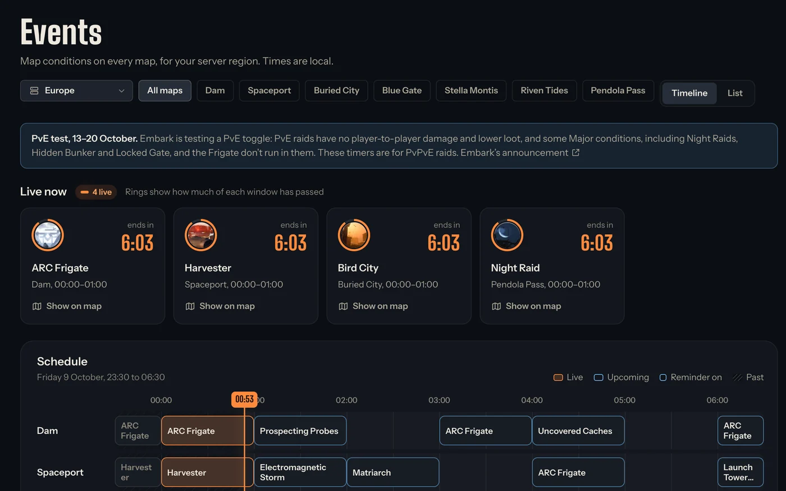
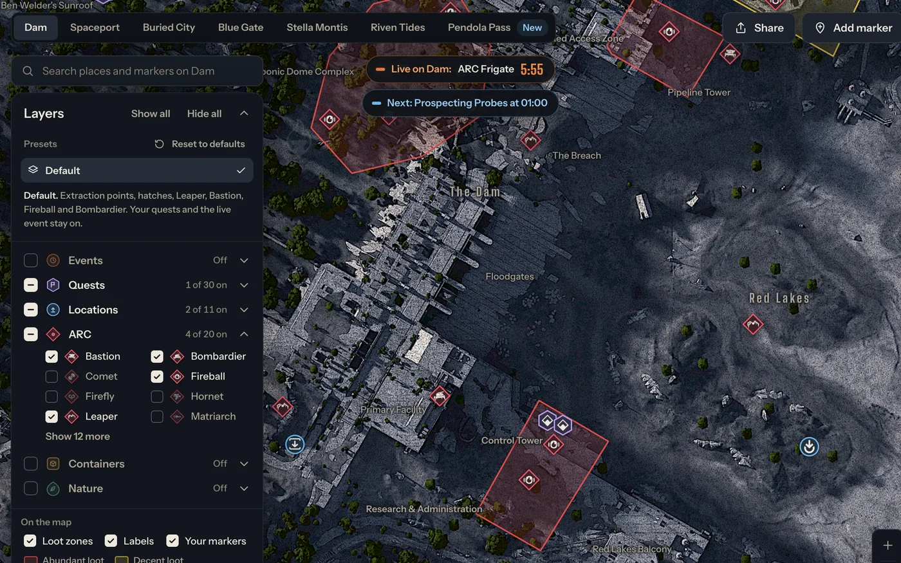
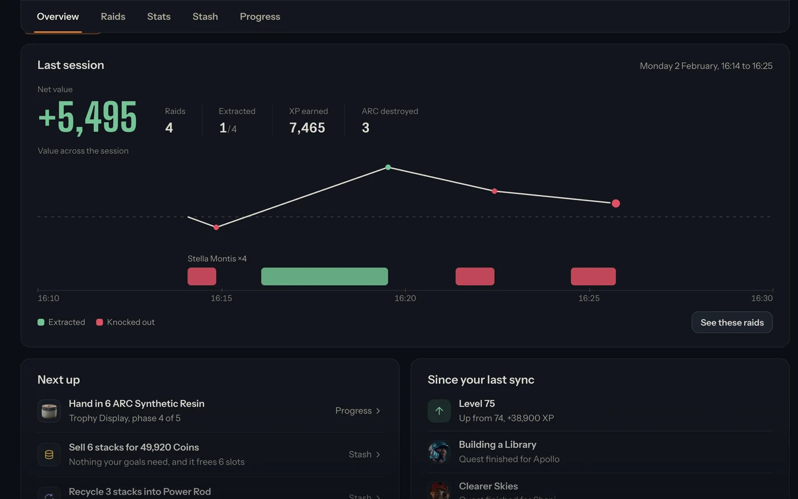
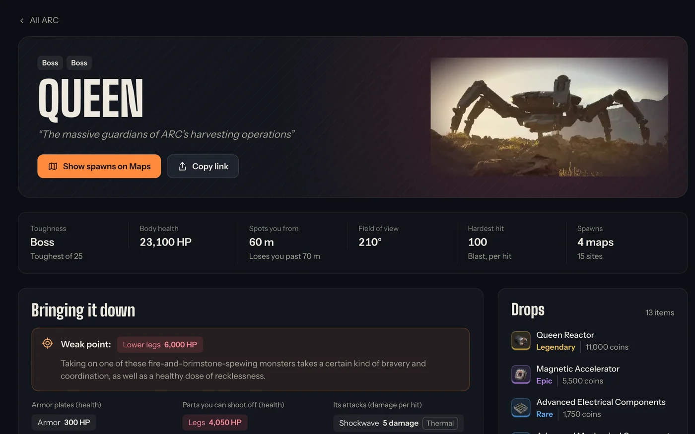
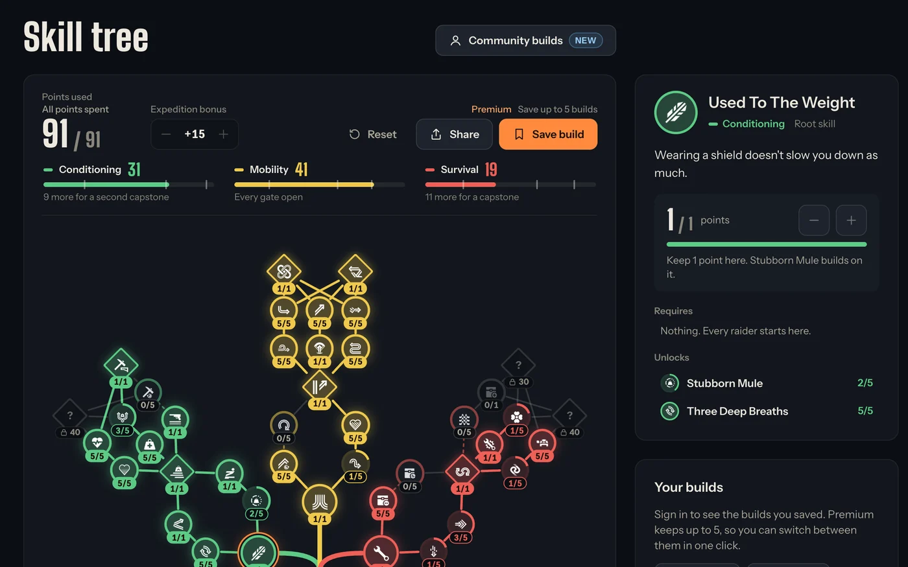
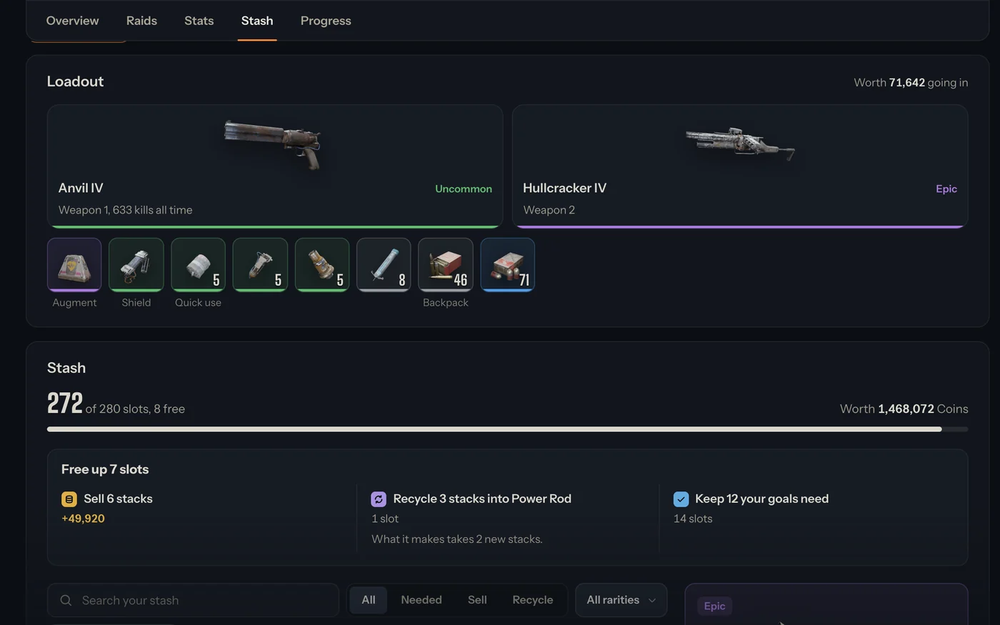
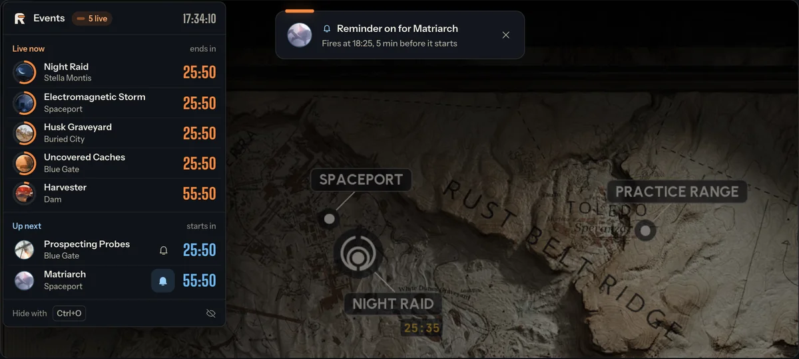

  

<h1 align="center">RaiderBuddy</h1>

The free companion for ARC Raiders, on the web and over your game.

  
  
  

  <b>Every timer, map, quest and item in ARC Raiders, in one place.</b> 
  Free in your browser, no account needed. On Windows it also sits on top of your game.

## Why raiders use it

- **Never miss the drop.** See which map conditions are live in your region, how long they last and what starts next. Get a reminder before the ones you care about.
- **Know before you go.** Loot, ARC, locked rooms and quest spots on every map, and the weak points and drops of every ARC.
- **Keep the right stuff.** Find out which items your quests, workshop and projects still need, and what to sell or recycle.

## What's inside

<table>
  <tr>
    <td width="50%" valign="top">
      
      <h3>⏱️ Live event timers</h3>
      Map conditions on every map, for all five server regions, with a timeline of what's next.
    </td>
    <td width="50%" valign="top">
      
      <h3>🗺️ Interactive maps</h3>
      Loot zones, ARC, resources, locked rooms and quest locations on every map, Pendola Pass included, plus markers of your own.
    </td>
  </tr>
  <tr>
    <td width="50%" valign="top">
      
      <h3>📊 My Raider</h3>
      Link your ARC Raiders account and see your raids by day, your stats, what your stash is worth and your progress.
    </td>
    <td width="50%" valign="top">
      
      <h3>🤖 ARC field guide</h3>
      Every ARC machine: health, weak points, the weapons that crack its armor, where it spawns and what it drops.
    </td>
  </tr>
  <tr>
    <td width="50%" valign="top">
      
      <h3>🌳 Skill tree planner</h3>
      Plan a build, share it as a link or a picture, and browse what the community has built.
    </td>
    <td width="50%" valign="top">
      
      <h3>🎒 Stash, sorted</h3>
      Your loadout and stash as the game shows them, with what each item is worth and what your goals still need.
    </td>
  </tr>
</table>

**And more:** [weekly trials](https://raiderbuddy.com/trials) with the best maps for each objective · every [quest](https://raiderbuddy.com/quests) with your progress · a [cheat sheet](https://raiderbuddy.com/cheat-sheet/needed-items) of the items to keep · an [item database](https://raiderbuddy.com/items) with values and recycling · [weapon stats](https://raiderbuddy.com/weapons) with time to kill · a shareable [tier list maker](https://raiderbuddy.com/tierlist) · and one search across all of it (<kbd>Ctrl</kbd> <kbd>K</kbd>).

## Timers on top of your game

RaiderBuddy for Windows puts a small panel over ARC Raiders, so you can see what's live without alt-tabbing.

- **Events, trials and your list** as overlay panels. Turn each one on or off.
- **One hotkey** (<kbd>Ctrl</kbd> <kbd>O</kbd>) shows or hides them.
- **Syncs My Raider** from your game account.
- **Free.** Windows 10 and 11.

  

Prefer GitHub? Every installer is on the [Releases](https://github.com/timlangner/RaiderBuddy/releases/latest) page.

## Free, with Premium if you want more

Everything above is free. [Premium](https://raiderbuddy.com/premium) adds event reminders, exact spawn points for trial objectives, 50 private map markers, 5 saved builds, your full raid history and stash advice, and no ads. It also keeps RaiderBuddy running.

## Community and feedback

[Discord](https://discord.gg/nfTH2wztpQ) is where updates are posted, questions get answered and ideas get picked up.

Found a bug or want something added? [Open an issue](https://github.com/timlangner/RaiderBuddy/issues/new) and include:

- what happened, and what you expected
- the steps to make it happen again
- the web page or app version, and your browser or Windows version
- a screenshot, if you can

---

RaiderBuddy is a fan project and is not affiliated with or endorsed by Embark Studios. ARC Raiders is a trademark of Embark Studios AB. RaiderBuddy is proprietary software; all rights reserved.
